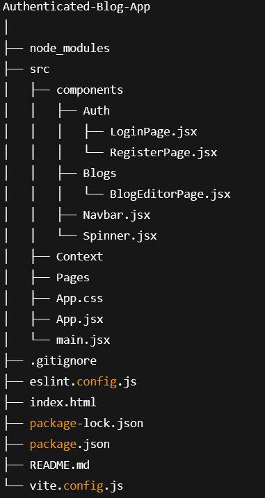

# React Authenticated Blog CMS

A modern React-based blog CMS application with authentication (login/register), protected routes, CRUD blog posts, loading spinner, and a professional responsive navbar.

---

Author

Yasin Tajali

- GitHub: [YT-Coder66](https://github.com/YT-coder66)

- LinkedIn: [linkedin_page](https://www.linkedin.com/in/yasin-tajali-malek-jahan-reactdev/)

- Email: pr0grmer6cd@gmail.com

---

## How It Works

- Users can register and login; authentication status is stored in React Context and localStorage.

- Private routes guard dashboard and post management pages.

- Blog posts are saved in localStorage to simulate persistent data.

- Users can create, edit, and delete posts.

- A loading spinner appears during async operations.

- The navbar updates based on authentication state, offering intuitive navigation.

- Responsive design ensures usability on all screen sizes.

---

## Technologies Used

- React 18+

- React Router v6

- React Context API

- CSS Modules (or CSS-in-JS)

- LocalStorage API

---

## Features

- **User Authentication:** Register, login, logout with client-side validation and protected routes.
- **Blog Management:** Create, read, update, delete blog posts.
- **Loading Spinner:** Visual feedback during async operations.
- **Responsive Navbar:** Sleek, modern navigation with hamburger menu for mobile.
- **Local Storage Persistence:** User session and blog posts are persisted in browser localStorage.
- **Clean UI/UX:** Professional styling and smooth user experience.
- **React Router v6:** For routing and protected routes.
- **Context API:** For auth and global state management.
- **No Backend Required:** Fully functional with localStorage (easy to connect to real backend).

---

## Getting Started

### Prerequisites

- Node.js (v14+ recommended)
- npm or yarn

---

## Project Structuer File

---

### Installation

- bash
git clone https://github.com/yourusername/Athenticated-Blog-App.git
cd Athenticated-Blog-App
npm install

## Running The App

npm run dev

---

## License

- This project is licensed under the MIT License.